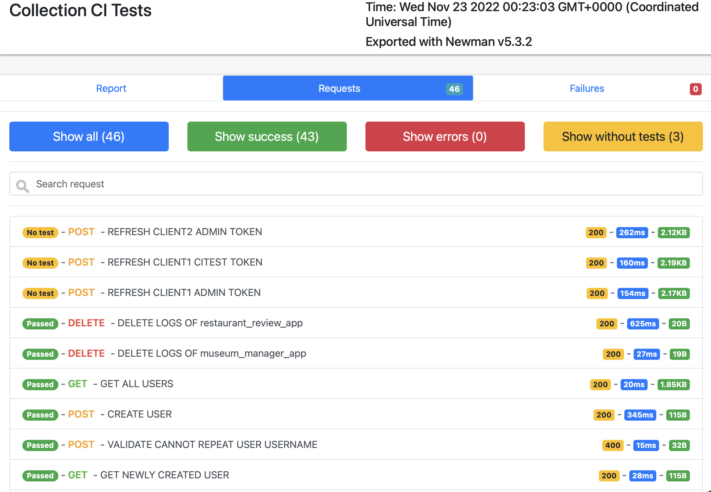
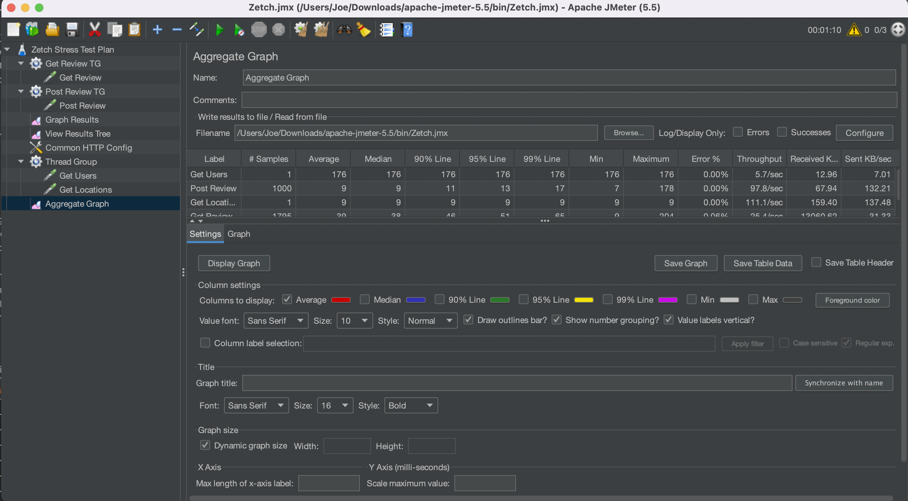
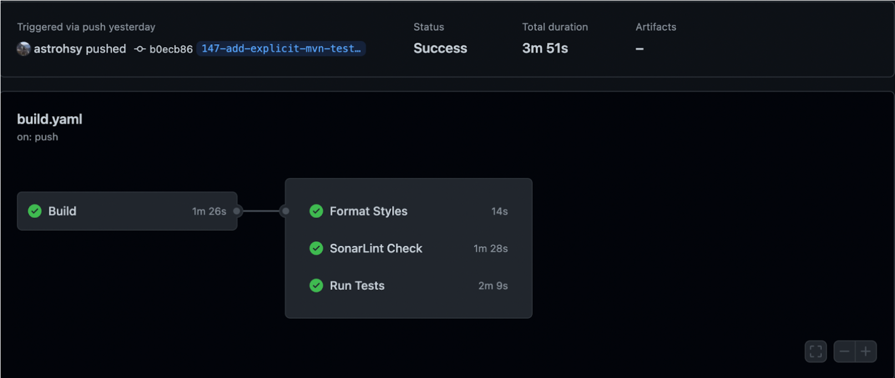
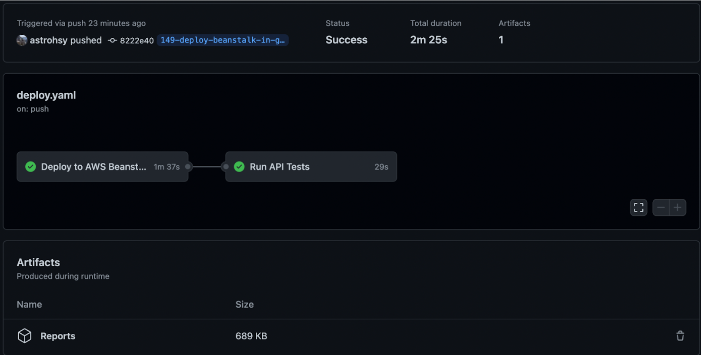

# Zetch API Server

## How to build, run, and test

### 1. Build and run entire development environment

**Important:** See a ZETCH team member for a `.env` file specifying secret values, place the file
in `src/main/resources/`.

```
docker-compose build && docker-compose up -d
```

Note: the docker-compose build section is only necessary if you have made code changes

### 2. Stop environment

```
docker-compose down --remove-orphans
```

### 3. View running logs

```
docker-compose logs -f
```

### 4. Run a specific service

Database: `docker-compose up db -d`

API: `docker-compose up api -d`

### 5. Testing

#### Unit and integration tests

Run all tests:

```shell
ZETCH/api_server$ ./mvnw test
```

Jacoco test coverage report is included in the repository in `api_server/reports/jacoco/index.html`.

Run unit tests only:

```shell
ZETCH/api_server$ ./mvnw test -Punit-tests
```

Run integration tests only:

```shell
ZETCH/api_server$ ./mvnw test -Pintegration-tests
```

#### System tests

System tests are run in Postman every time we push to `main`. Each test run generates a report,
which can be downloaded from the the Github Actions
logs [here](https://github.com/astrohsy/ZETCH/actions/workflows/api-test.yaml).

An example can be seen in the image
below:


System tests can also be run manually with Newman:

```shell
newman run https://api.getpostman.com/collections/23680701-9829f32b-1694-4065-b6b9-93cbc808c454?apikey={{postman-api-key}}
```

**Important:** See a ZETCH team member for postman-api-key.

#### Stress tests

Used on a local machine for testing most used features GET `/reviews` and POST `/reviews`. On the
local machine it processes approximately 110 req/min, but we can improve performance by deploying
more containers on AWS Beanstalk and scale up RDS instance.


The configuration for JMeter is included in the repo `./jmeter_stress_test.jmx`. To actually run the
test, you should see a Zetch member to get an issued user token.

## Style checker

```shell
ZETCH/api_server$ ./mvnw checkstyle:checkstyle
```

Checkstyle report is included in the repositorty in `api_server/reports/checkstyle.html`.

## Static analysis

```shell
ZETCH/api_server$ ./mvnw pmd:pmd
```

PMD report is included in the repository in `api_server/reports/pmd.html`.

In addition, we are utilizing SonarCloud for static analysis:

```
https://sonarcloud.io/project/overview?id=astrohsy_ZETCH
```

## CI / CD

Github Actions is used to perform automated build, tests, and deployment.

### .github/build.yml



- Try Build the project and check if it has bugs while building.
- Run `mvn tests` to perform Unit & Integration testing.
- Check awkward code styles and reformat the code.

### .github/deploy.yml



- Build & Deploy to AWS Beanstalk Instance (http://zetch.tech).
- Fetch the Postman collection for API Tests and execute the test suite.
- The report of API tests created and attached to the pipeline artifact.

###        

## API Documentation

### View Swagger UI in development

`localhost:8080/swagger-ui/index.html`

### View Swagger UI in production

`https://zetch.tech/swagger-ui/index.html`

### Authentication notes

All API endpoints are protected by OAuth2 authentication using AWS Cognito. Some endpoints perform
additional security checks. See the Swagger documentation for more details (for example, to view
client logs a user has to belong to that client).

For testing/demo, the following existing users can login:

- `admin`: admin user
- `amy`: regular user
- `bob`: regular user

Every user has the same password -- `123456`.

#### Generating Auth tokens

##### In Postman

Utilizing [variables](https://learning.postman.com/docs/sending-requests/variables/):


##### In Swagger UI

In Swagger UI, click on Authorize, then enter a client id from `.env`.

## Client

A sample client is located in the `web` folder.

### End-to-end tests

The checklist for manual end-to-end test is in the `web/README.md` file.

### How to develop your own third-party client

1. Contact the ZETCH team to get your own `client_id` and admin account credentials.
2. Develop your own frontend using available rest apis.
    - If the client needs to create new users, client must first login using their admin account
      credentials to retrieve an `access_token`. Then the client can access the `POST /users` api to
      create new users using the admin token.
    - Any api calls related to client end-users(e.g. create review) must include the
      user’s `access_token` which is retrieved by logging in using the given `client_id` and the
      created user’s username and password.
3. Some functionality our service can provide:
    - Manage users, locations, replies, and reviews and their respective relations.
    - Get data analysis on various locations, for example their average rating and a rating
      histogram.
    - Get logs of your client’s api requests to be used for KPI analysis.
4. Some example clients you can create!
    - A museum manager app - If you own a museum, we will authenticate your relationship with the
      museum and give you the credentials to manage the museum’s presence.
        - You will be able to see data analysis on your museum’s ratings, edit your museum’s
          information(e.g.
          description, address), reply to reviews on your museum, and view information about other
          competitor
          museums.
    - A restaurant recommender app - You can create an app where users can learn about different
      restaurants and rate the restaurants they have visited. You can then recommend similar
      restaurants from our service to end-users based on their previous ratings.
    - A food delivery app - You can use our service to populate your app with existing restaurants
      and their corresponding ratings and reviews. Then your end-users will be able to learn more
      about the restaurants before ordering food from them. 
