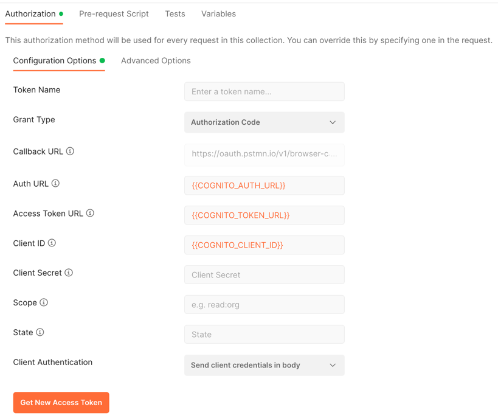

# Zetch API Server

### 1. Build and run entire development environment

```
docker-compose build && docker-compose up -d
```

note: the docker-compose build section is only necessary if you have made code changes

### 2. Stop environment

```
docker-compose down --remove-orphans
```

### 3. View running logs

```
docker-compose logs -f
```

### 4. Run specific service

database: `docker-compose up db -d`

api: `docker-compose up api -d`

### 5. View swagger UI of apis:

`localhost:8080/swagger-ui.html`

### 6. Run Jacoco test coverage:

```bash
mvn test
# Generated in target/site/jacoco/index.html
```

### View swagger UI of apis:

```bash
localhost:8080/swagger-ui.html
```

### Run PMD static analysis bug finder:

```bash
mvn pmd:pmd
# Generated in target/site/pmd.html
```

### Auth

Some routes are protected by OAuth2 authentication using Cognito.
Auth tokens can be generated either in Postman or Swagger UI.

In Postman, utilizing [variables](https://learning.postman.com/docs/sending-requests/variables/):



In Swagger UI, click on Authorize, then enter the client id.

See Discord for `.env` specifying secret values.

For a list of users which can log in with Cognito, see the `Application.commandLineRunner()` method.
Every user has the same password -- `123456`.
